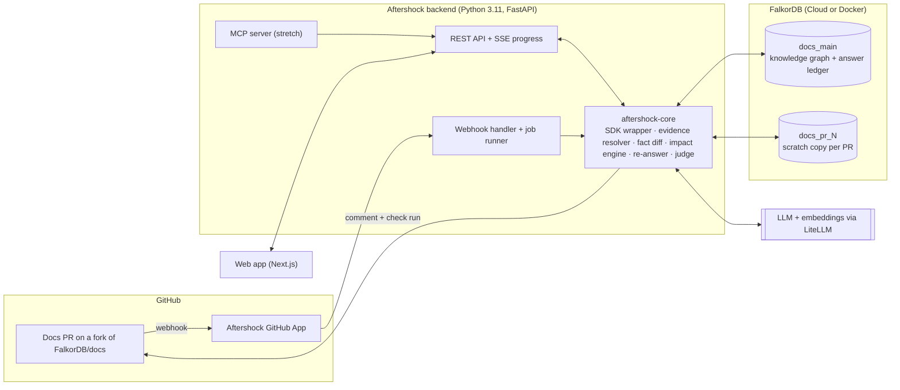
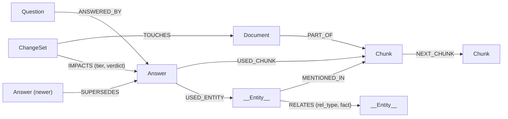
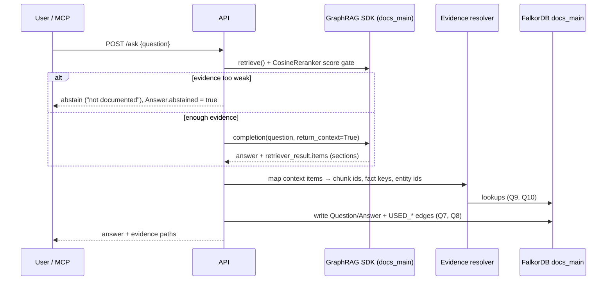
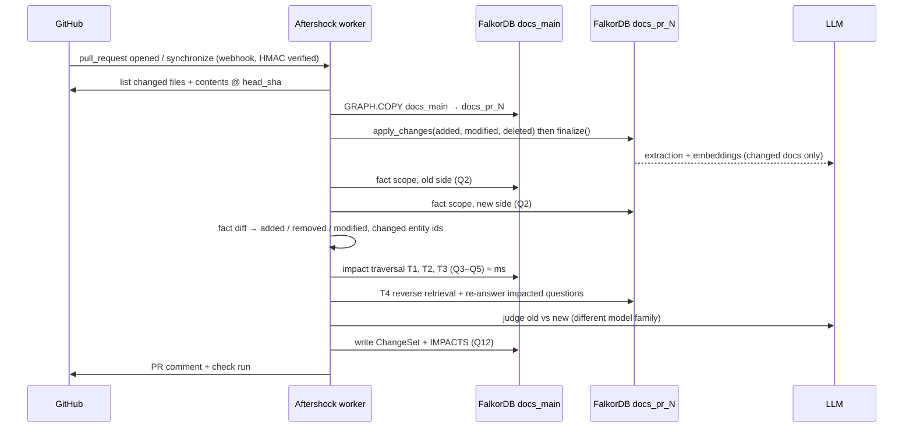

# Aftershock — System Design

**See what a docs change breaks *before* it merges.**

| | |
|---|---|
| Hackathon | Graph Hacks: Building Next-Gen RAG (WeMakeDevs × FalkorDB) — listed for October 2026 |
| Track | **Track 03 — Best Use Case of the GraphRAG SDK** (one track per submission) |
| Team | Up to 4 people (roles in §17) |
| One-line thesis | **Every answer is a node.** If a RAG assistant's answers live in the graph next to the facts they used, a docs change becomes a traversal to every answer it breaks. |
| Status of this doc | Pre-kickoff design. Rules allow ideas, notes, graph-model sketches and diagrams before the start; **main coding starts only after kickoff**. |

---

## 0. TL;DR

Docs-grounded AI assistants go stale silently. FalkorDB itself runs an AI "Docs Assistant" on docs.falkordb.com (FalkorDB/docs PR #470). When a docs PR changes something — e.g. PR #479 rewrote the GraphRAG SDK docs from the old `KnowledgeGraph` API to the new `GraphRAG` / `GraphSchema` API — nobody knows which answers the assistant has already given are now wrong, or which questions just lost their only evidence.

**Aftershock** is a GitHub App + web app built on the **FalkorDB GraphRAG SDK**:

1. It answers questions over a docs repo with the SDK and writes **every answer into FalkorDB as an `Answer` node**, linked to the chunks, entities and facts it relied on (the *answer ledger*).
2. On every docs PR it **copies the graph** (`GRAPH.COPY`), applies the PR with **`apply_changes()`**, **diffs the facts**, and runs a **multi-hop impact traversal** to find every answer the PR can affect — including answers that never cited the changed page.
3. It **re-answers only those questions** on the PR's graph, judges old vs new, and **posts a before/after report on the PR** with a check run that warns when a question loses all its evidence.
4. A **Replay Lab** replays real historical PRs of the FalkorDB docs repo and measures, honestly, how much each impact tier catches versus a citation-only baseline, and how much LLM cost it saves versus re-answering everything.

FalkorDB is the only database. Take it out and there is no retrieval, no ledger, no traversal — nothing left.

---

## 1. The one problem statement

> **When documentation changes, RAG assistants keep serving answers that were true yesterday. Teams can't see which answers a docs change invalidates until users hit them.**

Why it is real:

- Docs change constantly (API rewrites, renamed parameters, deprecations, deleted pages).
- Vector RAG re-embeds the changed file but has **no memory of what it already told people** and **no dependency graph** between answers and facts, so it cannot say *which* answers moved.
- The worst failures are indirect: an answer cited page B, but relied on a fact whose evidence lived in page A. A citation log alone misses it. A graph doesn't.

Who uses it: docs / DevRel teams running a docs assistant, internal-knowledge-base owners, OSS maintainers.

---

## 2. Why this is the winnable build (evidence from past winners)

| Pattern that won before | Where | How Aftershock uses it |
|---|---|---|
| One graph-native modeling insight ("make X a node") | Atrium, 1st at FalkorDB's *Memory Meets Motion* — each wrong mental model is its own node | Each **answer** is its own node, wired to its evidence |
| Honest benchmark, product built around the one provable win | Lethe, grand winner at WeMakeDevs × Cognee | Replay Lab on real PRs; report where the graph wins *and* where it doesn't |
| Deterministic authority, not the LLM | AgentCourt's "Bailiff", Hopper's traversal-as-proof | Impact set is computed by Cypher, not by an LLM guess |
| Acts where people already work | Drift — posts "what changed" comments on GitHub issues | Comments on the PR **before merge** |
| "Graph Matters" as the top criterion | Neo4j Aura Agent Hackathon | Rule 3 test: remove FalkorDB → product is gone |

Differentiation from the closest prior project (MemoryScope, a highlight at WeMakeDevs × Cognee, which flags answers via a citation-log join after a forget): Aftershock is **pre-merge**, **CI-native**, works at the **fact/entity level across documents (multi-hop)**, **re-answers automatically**, and is **measured on real commit history**.

Track 03 key-focus coverage (from the hackathon page):

| Track 03 focus | Where it lives |
|---|---|
| Ontology generated from raw docs | §7.1 ontology discovery + curation; ontology evolution when new doc types appear |
| Incremental sync with `apply_changes()` | §7.3 PR flow, §7.4 merge flow |
| Hybrid vector, keyword, and Cypher retrieval | SDK `MultiPathRetrieval` for every answer; Question vector index for reverse retrieval (T4) |
| Multi-hop graph expansion | Retrieval + impact tiers T2/T3 |
| Verified source attribution | Evidence resolver (§7.2) + claim check on re-answers (§9) |

---

## 3. What the user sees (three surfaces)

### 3.1 The PR comment (hero surface)

Posted by the Aftershock GitHub App on `pull_request.opened` / `synchronize`. Numbers below are **illustrative placeholders**, not results.

~~~markdown
### 🌊 Aftershock report — PR #479 (head 3f2c1ab)

**7 docs changed · 38 facts changed (12 added · 19 removed · 7 modified)**
**21 answers re-checked · 14 changed · 2 now unanswerable · 1 newly answerable**
Impact traversal: 11 ms · Report generated in 2m 04s

| Question | Verdict | Found via |
|---|---|---|
| How do I create a knowledge graph with GraphRAG SDK? | 🔴 CHANGED | T1 cited `graphrag/getting-started.mdx` |
| Which class do I use to define entity types? | 🔴 CHANGED | **T2 fact** `KnowledgeGraph —[REPLACED_BY]→ GraphRAG` |
| How do I connect GraphRAG SDK to FalkorDB Cloud? | 🔴 CHANGED | **T3 neighbour** `Ontology → GraphSchema` (never cited this page) |
| How do I load an ontology from a JSON file? | ⚠️ NOW UNANSWERABLE | T1 — only evidence deleted |

<details><summary>Before / after for 14 changed answers</summary> … </details>

⚠️ Coverage check: **2 questions lost all their evidence** in this PR (check run: warning)
[Open the full impact graph →](https://aftershock.app/r/479)
~~~

Plus a **GitHub check run**: `neutral/warning` when any question becomes unanswerable ("coverage regression"), `success` otherwise.

### 3.2 The web app

- **PR report page** — interactive impact graph: `ChangeSet → Document → Fact → Answer ← Question`, coloured by tier; word-level before/after diff per answer; the evidence path for each flag.
- **Ledger explorer** — every question's answer history as a `SUPERSEDES` chain; "as of commit X" view (what the assistant would have said then).
- **Ask** — chat over the docs; every answer is written to the ledger with its evidence.
- **Replay Lab dashboard** — recall per tier vs baseline, cost saved, judge noise floor, latency.

### 3.3 MCP server (stretch)

`ask_docs(question)` and `preview_impact(paths, contents)` so Claude Code / Cursor can check "what does my docs edit break?" before a PR exists.

---

## 4. Core idea: answers as nodes + impact tiers

### 4.1 Two layers in one graph

- **SDK layer (built by GraphRAG SDK, untouched):** `Document -[:PART_OF]-> Chunk`, `Chunk -[:NEXT_CHUNK]-> Chunk`, `__Entity__ -[:MENTIONED_IN]-> Chunk`, `__Entity__ -[:RELATES {rel_type, fact, source_chunk_ids}]-> __Entity__`. Entity ids are deterministic (`name__type`), which makes cross-graph diffs possible.
- **Aftershock layer (ours):** `Question`, `Answer`, `ChangeSet` nodes and `ANSWERED_BY`, `USED_CHUNK`, `USED_ENTITY`, `SUPERSEDES`, `TOUCHES`, `IMPACTS` edges.

### 4.2 Impact tiers (computed by Cypher on `docs_main`)

| Tier | Name | Rule | Why a vector store can't do it |
|---|---|---|---|
| **T1** | Cited | Answer used a chunk of a modified/deleted document | (Vector RAG with a citation log *can* — this is the baseline) |
| **T2** | Fact | Answer's context included a fact (RELATES edge) that the PR removed or modified | Needs fact-level provenance keyed across two graph versions |
| **T3** | Neighbour | Answer used an entity within 1 hop of a changed entity (hub-dampened, semantically gated) | Needs a 2-hop traversal: changed entity → neighbour → answer |
| **T4** | Reverse retrieval | A newly added/modified fact is semantically close to a stored question (vector search from fact → questions) | Inverts RAG: change → questions, using the graph's fact embeddings |

Every flagged answer is **re-answered and judged** before it is reported as changed, so false positives cost money, not credibility. Recall is the metric that matters; precision controls cost.

---

## 5. Architecture



| Component | Responsibility | Tech |
|---|---|---|
| `aftershock-core` | All graph + LLM logic; the only place that talks to FalkorDB | Python 3.11, `graphrag-sdk[litellm]`, `falkordb` client, asyncio |
| API service | `/ask`, `/webhooks/github`, reports, ledger, replay, impact preview | FastAPI, SSE |
| Job runner | Runs PR analyses off the request path; one job per `(pr, head_sha)` | `asyncio` tasks + job status stored on the `ChangeSet` node (FalkorDB stays the only DB) |
| GitHub App | Receives PR/push events; posts comments + check runs | GitHub REST API, HMAC-verified webhooks |
| Web app | Report, ledger, ask, replay dashboard | Next.js, React, Cytoscape.js (graph), `diff` (word diff) |
| FalkorDB | Knowledge graph, answer ledger, scratch graphs, vector + full-text indexes | FalkorDB Cloud free tier or Docker |
| LLM layer | Extraction, answers, judge, embeddings | LiteLLM; answer model and judge model from **different** model families |

---

## 6. Graph data model

### 6.1 Diagram



### 6.2 SDK layer (read-only for us)

| Element | Key properties we rely on |
|---|---|
| `Document` | `id` = the `document_id` we pass (**repo-relative path**, e.g. `graphrag/getting-started.mdx`), `path`, `content_hash` |
| `Chunk` | `id` (uid), `text`, `index`, `embedding` |
| `__Entity__` (+ domain label) | `id` = `name__type` (deterministic), `name`, `description`, `embedding` |
| `RELATES` | `rel_type`, `fact`, `src_name`, `tgt_name`, `source_chunk_ids`, `weight`, `embedding` |
| `MENTIONED_IN`, `PART_OF`, `NEXT_CHUNK` | provenance edges |

**Fact key** (our convention, stable across graph copies): `"{src_entity_id}|{rel_type}|{tgt_entity_id}"`.

### 6.3 Aftershock layer

| Node | Properties |
|---|---|
| `Question` | `id` (sha1 of normalised text), `text`, `embedding` (vecf32, same dims as SDK embedder), `source` (`generated` / `curated` / `live` / `mcp`), `created_at` |
| `Answer` | `id` (uuid), `text`, `commit_sha`, `graph` (`docs_main`), `status` (`current` / `superseded`), `abstained` (bool), `fact_keys` (list), `entity_ids` (list), `doc_ids` (list), `model`, `created_at` |
| `ChangeSet` | `id` (`pr-{n}-{sha7}`), `pr`, `base_sha`, `head_sha`, `doc_ids` (added/modified/deleted), `facts_added/removed/modified` (counts), `status` (`queued` / `running` / `done` / `failed`), `timings` (JSON), `created_at` |

| Edge | Properties |
|---|---|
| `(:Question)-[:ANSWERED_BY]->(:Answer)` | — |
| `(:Answer)-[:USED_CHUNK]->(:Chunk)` | `rank` |
| `(:Answer)-[:USED_ENTITY]->(:__Entity__)` | — |
| `(:Answer)-[:SUPERSEDES]->(:Answer)` | `pr`, `verdict` |
| `(:ChangeSet)-[:TOUCHES]->(:Document)` | `op` (`added` / `modified` / `deleted`) |
| `(:ChangeSet)-[:IMPACTS]->(:Answer)` | `tier`, `via` (list of strings), `verdict`, `new_answer`, `judge_reason`, `score` |

Design choices:

- **Lists on `Answer` as well as edges.** SDK clean-up on `update()`/`delete_document()` replaces chunks and removes orphaned entities, which detaches our edges in whatever graph it runs on. We therefore (a) run all impact traversals on `docs_main` *before* the change is applied there, and (b) keep `fact_keys` / `entity_ids` / `doc_ids` as properties so history survives.
- **No `__Entity__` label on our nodes**, so SDK dedup/resolution never touches them (⚠ verify on Day 1 that `finalize()` ignores foreign labels).
- **Indexes we add:** range index on `Question.id`, `Answer.id`, `Answer.status`, `ChangeSet.id`; vector index on `Question.embedding`.

---

## 7. Pipelines

### 7.1 Bootstrap: build `docs_main`

1. **Corpus.** Fork `FalkorDB/docs` (public). Check out the base commit for the demo (the commit *before* the PRs we will replay). Ingest content files only (`*.md`, `*.mdx`); skip images, config, components.
2. **MDX cleaner (custom `LoaderStrategy`).** The site is MDX: strip JSX components (`<CodeGroup>`, `<Accordion…>`, `<Note>`, ``, `style={{…}}`) but **keep their inner text and fenced code**; keep front-matter `title`/`description` as document metadata. Pair with the SDK's document-aware Markdown ingestion so heading breadcrumbs survive.
3. **Ontology.** Run the SDK's ontology *discovery* on a sample of pages, then curate into a `GraphSchema` (JSON, committed to the repo). Starting point:
   - Entities: `Product` (FalkorDB, FalkorDB Cloud, GraphRAG SDK, Browser), `Command` (GRAPH.QUERY, GRAPH.COPY…), `CypherFeature` (clauses, functions), `Algorithm`, `ConfigParameter`, `ClientLibrary`, `Integration`, `APIClass` (e.g. `GraphRAG`, `KnowledgeGraph`, `GraphSchema`), `Concept`, `Limitation`, `Version`.
   - Relations: `SUPPORTS`, `REQUIRES`, `REPLACED_BY`, `DEPRECATED_IN`, `INTRODUCED_IN`, `HAS_PARAMETER`, `HAS_DEFAULT`, `PART_OF_PRODUCT`, `INTEGRATES_WITH`, `LIMITED_BY`, `CONFIGURED_BY`.
   - When a PR introduces a new kind of thing, use the SDK's ontology *evolution* flow to extend the schema (shows the Track 03 "ontology from raw docs" focus).
4. **Ingest** with `document_id = repo-relative path`, then `finalize()` once.
5. **Post-ingest hook:** create our indexes; compute the entity-degree table for hub dampening (Q11).
6. **Question bank.**
   - ~150 **generated** questions (LLM over each page, de-duplicated by embedding similarity).
   - ~40 **curated** hard questions, many multi-hop ("Which clients can call `GRAPH.COPY`?", "How do I restrict PageRank to one relationship type?").
   - Answer all of them once → ledger populated. All data is public or synthetic.

### 7.2 Ask flow → ledger



**Evidence resolver** (the most important piece of glue). Under the SDK's default `MultiPathRetrieval`, context items are whole *sections* (`passages`, `facts`, `relationships`, `entities`, `cypher_results`, `hint`) and passages carry a `[Source: <path>]` prefix instead of a `chunk_id`. So:

- `passages` → split on `[Source: …]` → `(path, text)` → find the chunk of that document whose text contains the passage's first ~120 normalised characters (Q9).
- `facts` / `relationships` → parse `src —[TYPE]→ tgt: fact` lines → look up the `RELATES` edge by names + `rel_type` → `fact_key` (Q10).
- `entities` → names → entity ids.

⚠ Day-1 spike: print real `retriever_result.items` and lock the exact formats with a unit test. **Plan B:** wrap `MultiPathRetrieval` in a custom `RetrievalStrategy` subclass that records chunk ids / edge ids as it builds each section; **Plan C:** use `LocalRetrieval` (which populates `chunk_id`) for ledger capture only.

**Abstention** is enforced in code, not left to the prompt: `retrieve()` with a `CosineReranker`, gate on score/count (thresholds calibrated on our corpus), then `completion()`. We keep the SDK's default prompt template so its `</context>` injection guard stays on.

### 7.3 PR flow (the core)



Steps in detail:

1. **Filter.** Ignore PRs that touch no content files (e.g. a widget/script PR) — but still record a `ChangeSet` with `0 impacts` (these are our false-positive controls in the Replay Lab).
2. **Scratch graph.** `GRAPH.COPY docs_main docs_pr_{n}_{sha7}`. The copy includes all nodes, relationships, properties **and indexes**, and is a consistent snapshot; `docs_main` stays readable and writable during the copy. Delete the scratch graph after the report (or after 24 h).
3. **Apply the PR.** A `GraphRAG` instance with `graph_name = docs_pr_…` calls `apply_changes(added=…, modified=…, deleted=…)`; per-file failures come back as `BatchEntry` errors instead of exceptions — surface them in the report. Call `finalize()` **once** per batch (its dedup is O(graph size)). `update()` short-circuits unchanged content via its SHA-256 hash, so touch-only PRs are cheap.
4. **Fact diff.**
   - Scope `S` = entities mentioned in the changed documents on either side (Q1 on both graphs).
   - Pull all `RELATES` edges touching `S` from both graphs (Q2) and diff by `fact_key`.
   - `removed` = old − new; `added` = new − old; `modified` = same key, fact text differs beyond a normalisation + embedding-similarity threshold (to ignore re-extraction rephrasing).
   - `changed_entity_ids` = endpoints of changed facts + entities whose description changed materially + entities that disappeared.
5. **Impact traversal on `docs_main`** (graph unchanged yet, ledger edges intact): T1 (Q3), T2 (Q4), T3 (Q5, hub-dampened + semantic gate). T4 (Q6) runs the added/modified facts' embeddings against the `Question` vector index.
6. **Budget + priority.** Merge tiers, de-duplicate, sort T1 > T2 > T4 > T3 by score, cap at `MAX_RECHECKS` per PR (e.g. 60). The comment says so if the cap truncated anything.
7. **Re-answer** each impacted question on `docs_pr_…` with the same ask flow (abstention gate + `return_context=True`).
8. **Judge** (§9) → verdict per answer: `UNCHANGED`, `REWORDED`, `CHANGED`, `NOW_ABSTAINS`, `NOW_ANSWERS`.
9. **Persist + report.** Write `ChangeSet`, `TOUCHES`, `IMPACTS` into `docs_main` (Q12); post/update the PR comment (edit the previous Aftershock comment on `synchronize`); create the check run (`neutral` + warning when any `NOW_ABSTAINS`).

### 7.4 Merge flow

On `pull_request.closed` with `merged = true` (or `push` to the default branch):

1. `apply_changes()` on `docs_main` with the same file set, then `finalize()`.
2. For every `IMPACTS` edge of that `ChangeSet` with verdict ≠ `UNCHANGED`: re-answer on `docs_main` (so new `USED_*` edges point at `docs_main`'s own chunk ids), create the new `Answer`, `SUPERSEDES` the old one (Q13), set the old one's `status = 'superseded'`.
3. Delete the scratch graph.

Why re-answer on main instead of promoting the scratch graph: chunk ids are UUIDs created at ingestion, so ids in `docs_pr_…` would not match a separately ingested `docs_main`. Re-answering only the impacted set keeps the ledger consistent and is cheap.

### 7.5 Replay Lab (evaluation harness)

Goal: an honest, reproducible number for "how much of the real change does Aftershock catch, and at what cost?"

1. Pick **20–25 historical PRs** of `FalkorDB/docs` that touch content (e.g. PR #479, the GraphRAG SDK v0 → v1 docs rewrite), plus **3–5 non-content PRs** (e.g. PR #470, the Docs Assistant widget) as zero-impact controls. Replay them **in order** on the fork, starting from the bootstrap commit.
2. **Ground truth (oracle).** For each graph state `k`, re-answer **all** questions (temperature 0). An answer "truly changed" between `k-1` and `k` if the judge says `CHANGED` / `NOW_ABSTAINS` / `NOW_ANSWERS`.
3. **Noise floor.** Ask every question twice on the *same* state and judge — the rate of "changed" here is judge/LLM noise. Report it next to every result; never hide it.
4. **Judge calibration.** Hand-label ~40 before/after pairs; report judge agreement with humans.
5. **Metrics per PR and overall:**
   - Impact **recall** = flagged ∩ truly-changed / truly-changed — for **T1 only** (citation-log baseline), **T1+T2**, **T1+T2+T3**, **all tiers**.
   - **Precision** of the flag set (drives cost).
   - **Cost saved** = 1 − (re-answered / all questions), and LLM calls/tokens per PR.
   - **Latency**: impact traversal ms (p50/p95), end-to-end PR report time.
   - False positives on the control PRs.
6. Publish per-PR JSON + a chart in the dashboard and README. If T2–T4 add little on this corpus, **say so** and explain which kinds of change they catch.

Oracle cost scales with `questions × (PRs + 1) × ~2 LLM calls` — keep the question bank at ~190 and use a small model; cache everything by `(graph_state, question_id)`.

---

## 8. Cypher query catalog

These are the queries the product depends on (the README must list them). FalkorDB implements a subset of OpenCypher: ⚠ check each clause against the *Cypher support* and *known limitations* pages on Day 1 (list comprehensions, `any()`, `UNWIND` of maps, `OR` in `WHERE`).

**Q1 — entities mentioned in changed documents (run on both graphs)**
```cypher
MATCH (d:Document)-[:PART_OF]->(:Chunk)<-[:MENTIONED_IN]-(e:__Entity__)
WHERE d.id IN $doc_ids
RETURN DISTINCT e.id AS entity_id
```

**Q2 — all facts touching the scope (run on both graphs, diff in Python by fact key)**
```cypher
MATCH (s:__Entity__)-[r:RELATES]->(t:__Entity__)
WHERE s.id IN $scope OR t.id IN $scope
RETURN s.id AS src, r.rel_type AS rel, t.id AS tgt, r.fact AS fact
```

**Q3 — T1 Cited: answers that used a chunk of a changed document**
```cypher
MATCH (d:Document)-[:PART_OF]->(:Chunk)<-[:USED_CHUNK]-(a:Answer {status: 'current'})
WHERE d.id IN $doc_ids
RETURN a.id AS answer_id, collect(DISTINCT d.id) AS via, 'T1' AS tier
```

**Q4 — T2 Fact: answers whose context contained a changed fact**
```cypher
MATCH (a:Answer {status: 'current'})
WHERE any(k IN a.fact_keys WHERE k IN $changed_fact_keys)
RETURN a.id AS answer_id,
       [k IN a.fact_keys WHERE k IN $changed_fact_keys] AS via,
       'T2' AS tier
```

**Q5 — T3 Neighbour: changed entity → neighbour → answer (hub-dampened)**
```cypher
MATCH (x:__Entity__)-[:RELATES]-(y:__Entity__)
WHERE x.id IN $changed_entity_ids AND NOT y.id IN $hub_ids
MATCH (y)<-[:USED_ENTITY]-(a:Answer {status: 'current'})
WHERE NOT a.id IN $already_flagged
RETURN a.id AS answer_id, collect(DISTINCT x.name + ' → ' + y.name) AS via, 'T3' AS tier
```
(Plus the 1-hop variant `(x)<-[:USED_ENTITY]-(a)` for answers that used the changed entity itself.) The semantic gate — keep only answers whose question embedding is within θ₃ of at least one changed fact embedding — runs in Python on the returned candidates.

**Q6 — T4 Reverse retrieval: changed fact → nearest stored questions**
```cypher
CALL db.idx.vector.queryNodes('Question', 'embedding', 10, vecf32($fact_embedding))
YIELD node, score
MATCH (node)-[:ANSWERED_BY]->(a:Answer {status: 'current'})
RETURN a.id AS answer_id, node.text AS question, score, 'T4' AS tier
```
(FalkorDB returns a cosine *distance* here — lower is closer; the SDK converts to similarity as `1 − score`. Threshold θ₄ is calibrated in the Replay Lab.)

**Q7 — write a Question + Answer**
```cypher
MERGE (q:Question {id: $qid})
  ON CREATE SET q.text = $qtext, q.embedding = vecf32($qemb), q.source = $source, q.created_at = timestamp()
CREATE (a:Answer {id: $aid, text: $answer, commit_sha: $sha, graph: $graph, status: 'current',
                  abstained: $abstained, fact_keys: $fact_keys, entity_ids: $entity_ids,
                  doc_ids: $doc_ids, model: $model, created_at: timestamp()})
CREATE (q)-[:ANSWERED_BY]->(a)
```

**Q8 — attach evidence edges**
```cypher
MATCH (a:Answer {id: $aid})
UNWIND $chunk_ids AS cid
MATCH (c:Chunk {id: cid})
CREATE (a)-[:USED_CHUNK]->(c)
```
```cypher
MATCH (a:Answer {id: $aid})
UNWIND $entity_ids AS eid
MATCH (e:__Entity__ {id: eid})
CREATE (a)-[:USED_ENTITY]->(e)
```

**Q9 — resolve a passage to its chunk**
```cypher
MATCH (d:Document {id: $doc_id})-[:PART_OF]->(c:Chunk)
WHERE c.text CONTAINS $passage_prefix
RETURN c.id AS chunk_id
LIMIT 1
```

**Q10 — resolve a fact line to its key**
```cypher
MATCH (s:__Entity__ {name: $src})-[r:RELATES {rel_type: $rel}]->(t:__Entity__ {name: $tgt})
RETURN s.id + '|' + r.rel_type + '|' + t.id AS fact_key, s.id AS src_id, t.id AS tgt_id
LIMIT 1
```

**Q11 — hub entities (for dampening)**
```cypher
MATCH (e:__Entity__)-[r:RELATES]-()
WITH e, count(r) AS degree
WHERE degree > $hub_threshold
RETURN e.id AS entity_id, degree
```
(Threshold = 95th percentile degree, computed at bootstrap and after each merge. Optional upgrade: FalkorDB's built-in PageRank via `CALL algo.pageRank(...)` — check the signature in the algorithms docs.)

**Q12 — persist the report**
```cypher
MERGE (cs:ChangeSet {id: $cs_id})
SET cs.pr = $pr, cs.base_sha = $base, cs.head_sha = $head, cs.doc_ids = $doc_ids,
    cs.status = 'done', cs.timings = $timings_json, cs.created_at = timestamp()
WITH cs
UNWIND $impacts AS imp
MATCH (a:Answer {id: imp.answer_id})
MERGE (cs)-[i:IMPACTS]->(a)
SET i.tier = imp.tier, i.via = imp.via, i.verdict = imp.verdict,
    i.new_answer = imp.new_answer, i.judge_reason = imp.reason, i.score = imp.score
```

**Q13 — supersede on merge**
```cypher
MATCH (old:Answer {id: $old_id}), (new:Answer {id: $new_id})
SET old.status = 'superseded'
CREATE (new)-[:SUPERSEDES {pr: $pr, verdict: $verdict}]->(old)
```

**Q14 — "as of" view (ledger time travel)**
```cypher
MATCH (:Question {id: $qid})-[:ANSWERED_BY]->(a:Answer)
WHERE a.created_at <= $as_of
RETURN a.text, a.commit_sha, a.created_at
ORDER BY a.created_at DESC
LIMIT 1
```

**Q15 — impact subgraph for the report UI**
```cypher
MATCH (cs:ChangeSet {id: $cs_id})-[i:IMPACTS]->(a:Answer)<-[:ANSWERED_BY]-(q:Question)
OPTIONAL MATCH (a)-[:USED_CHUNK]->(:Chunk)<-[:PART_OF]-(d:Document)
RETURN q.text AS question, a.text AS old_answer, i.new_answer AS new_answer,
       i.tier AS tier, i.verdict AS verdict, i.via AS via, collect(DISTINCT d.id) AS docs
```

---

## 9. Re-answer judge

Two stages, cheapest first.

**Stage 1 — deterministic (no LLM):**

| Condition | Verdict |
|---|---|
| Normalised texts equal, or both abstained | `UNCHANGED` |
| Old answered, new abstained | `NOW_ABSTAINS` (coverage regression → check-run warning) |
| Old abstained, new answered | `NOW_ANSWERS` (coverage gain, shown in green) |
| Fenced code blocks differ in identifiers / API names | strong hint for Stage 2 |

**Stage 2 — LLM judge** (temperature 0, **different model family** from the answer model, strict JSON):

```json
{ "verdict": "UNCHANGED | REWORDED | CHANGED",
  "changed_claims": [{"old": "...", "new": "..."}],
  "reason": "one sentence" }
```

Rubric: `REWORDED` = same facts, different wording (not reported as a change). `CHANGED` = at least one factual claim, API name, parameter, default or step differs.

**Claim check on the new answer:** using the `return_context=True` evidence, ask the judge to list any statement not supported by it (the SDK's documented unsupported-claims pattern). Unsupported claims get an ⚠ badge in the report.

**Calibration:** ~40 hand-labelled pairs; publish judge–human agreement in the Replay Lab.

---

## 10. APIs, GitHub App, MCP

### 10.1 REST API (FastAPI)

| Method + path | Purpose |
|---|---|
| `POST /ask` | `{question}` → `{answer_id, answer, abstained, evidence: [{doc, chunk_id, fact_key}]}` |
| `GET /questions/{id}/history?as_of=` | Answer history / time travel (Q14) |
| `POST /webhooks/github` | PR + push events (HMAC `X-Hub-Signature-256` verified) |
| `GET /changesets/{id}` | Report JSON |
| `GET /changesets/{id}/graph` | Nodes/edges for the impact graph (Q15) |
| `GET /changesets/{id}/events` | SSE progress: copy → apply → diff → impact → re-answer → judge → post |
| `POST /impact/preview` | Dry run on uncommitted content `{files: [{path, content, op}]}` (used by MCP / CLI) |
| `GET /replay/summary` | Replay Lab metrics |
| `GET /health` | FalkorDB + LLM reachability |

### 10.2 GitHub App

- Permissions: *Contents: read*, *Pull requests: read & write*, *Checks: read & write*, *Metadata: read*. Nothing else.
- Events: `pull_request` (`opened`, `synchronize`, `reopened`, `closed`), `push` (default branch).
- One job per `(pr, head_sha)`; a newer `synchronize` cancels the older job.
- The comment is **upserted** (found by a hidden `<!-- aftershock -->` marker) so the PR thread stays clean.
- Fallback if App setup eats time: a GitHub Action that calls `POST /impact/preview` and posts the comment with `GITHUB_TOKEN`.

### 10.3 MCP server (stretch)

Tools `ask_docs(question)` and `preview_impact(files)` → thin wrappers over the REST API. FalkorDB's official MCP server exists for raw graph access; ours exposes the *product* operations.

---

## 11. Frontend

| Page | Content |
|---|---|
| `/r/[pr]` — PR report | Summary counters; impact graph (Cytoscape.js: ChangeSet → Document → Fact → Answer ← Question, colour by tier, click an answer to highlight its evidence path); word-level before/after diff; judge reason; claim-check badges; timings incl. the traversal ms |
| `/ledger` | Search questions; `SUPERSEDES` timeline per question; "as of commit" slider |
| `/ask` | Chat over the docs; shows evidence and that the answer was written to the ledger |
| `/lab` | Replay Lab: recall by tier vs T1-only baseline, precision, cost saved, noise floor, judge agreement, latency; per-PR drill-down |
| `/how` | Architecture diagram, graph model, the Cypher catalog (judges read this) |

Design goal: the impact graph is the "aha" visual — the moment a T3 flag lights up a path to an answer that never cited the changed page.

---

## 12. Tech stack and repo layout

- **Backend:** Python 3.11, `graphrag-sdk[litellm]` (async API), `falkordb` Python client (for `GRAPH.COPY` and raw Cypher), FastAPI, Pydantic, httpx.
- **LLM:** via LiteLLM — a small, cheap model for extraction/answers, a different family for the judge; SDK embedder at 256 dims.
- **Frontend:** Next.js + TypeScript + Tailwind, Cytoscape.js, a word-diff library.
- **Local dev:** Docker Compose (`falkordb/falkordb:latest` with the Browser on :3000, `api`, `web`).

```
aftershock/
├── core/                    # aftershock-core (Python package)
│   ├── ingest.py            # GraphRAG SDK wrapper, bootstrap, apply_changes
│   ├── loaders/mdx.py       # MDX-cleaning LoaderStrategy
│   ├── ontology/            # discovered + curated GraphSchema JSON
│   ├── ledger.py            # Question/Answer writes (Q7, Q8, Q13)
│   ├── evidence.py          # evidence resolver (Q9, Q10)
│   ├── diff.py              # fact diff across graphs (Q1, Q2)
│   ├── impact.py            # tiers T1–T4 (Q3–Q6, Q11)
│   ├── reanswer.py          # abstention-gated completion
│   ├── judge.py             # §9
│   └── cypher/*.cypher      # every query in §8, loaded by name
├── api/                     # FastAPI app, GitHub App handlers, SSE
├── web/                     # Next.js app
├── eval/                    # Replay Lab: replay.py, questions/, results/*.json
├── mcp/                     # MCP server (stretch)
├── infra/                   # docker-compose.yml, deploy configs, seed scripts
├── docs/                    # SYSTEM_DESIGN.md (this file), GRAPH_MODEL.md
├── AI_USAGE.md              # disclosure of AI coding assistants (rule 10)
└── README.md                # setup, graph model, Cypher queries, track, demo links
```

---

## 13. Deployment and demo mode

- **FalkorDB:** FalkorDB Cloud (no local setup) or Docker on a small VM.
- **API + worker:** a host with a persistent process for webhooks (Railway / Render / Fly).
- **Web:** Vercel.
- **GitHub:** a demo org with a fork of `FalkorDB/docs`; the App installed only there.
- **Secrets:** LLM keys, GitHub App private key + webhook secret, FalkorDB credentials — env vars only.

**Demo mode** (`DEMO_MODE=true`): judges without API keys still get the full experience — the seeded graph contains the bootstrap ledger, three recorded PR reports (including #479) and the Replay Lab results; Ask serves cached answers for the question bank. A banner explains that live mode needs a key. Live mode can replay PR #479 end-to-end on demand.

---

## 14. Non-functional requirements

**Performance targets** (measure and show real numbers; don't claim them in advance):
- Impact traversal T1–T3 on `docs_main`: p95 < 100 ms.
- PR report for ≤ 5 changed content files: < 3 min (dominated by LLM calls).
- Ingestion work proportional to changed documents only.

**Cost control:** small models; cache answers by `(graph_state, question_id)`; `MAX_RECHECKS` per PR; PRs touching > N content files are sampled with a warning; cancel superseded jobs; `update()` hash short-circuit for untouched files.

**Security:** HMAC-verified webhooks; least-privilege App; never execute repo code (we only read file contents); treat docs text as data — keep the SDK's default prompt template so its `</context>` injection guard stays on; rate-limit `/ask`; store PR numbers and SHAs only — no author names or other personal data.

**Hackathon rule compliance:**

| Rule | How we comply |
|---|---|
| FalkorDB is the primary DB and central | It is the *only* DB: knowledge graph, ledger, job state, vector + full-text indexes |
| Graph does real work (remove it → product breaks) | Retrieval, ledger, impact traversal and scratch copies all live in FalkorDB |
| Allowed data only | Public docs repo + synthetic/generated questions; no personal data |
| Main work starts after kickoff | This document + sketches only before the start |
| Submission contents | Public repo, README with setup + graph model, Cypher catalog (§8), demo video, live deployment + local setup, track = Track 03 |
| AI assistant disclosure | `AI_USAGE.md` |
| Team understands the code | Every member owns one module end-to-end and can explain the model and queries |

---

## 15. Success criteria (what we must be able to show)

1. A real replayed PR (#479) produces a correct PR comment end-to-end on the live deployment.
2. At least one **T2/T3/T4 catch** that a citation-only baseline misses, shown visually as a path.
3. Replay Lab numbers over ≥ 20 real PRs: recall by tier, cost saved, noise floor, judge agreement, latency.
4. A coverage-regression warning (`NOW_ABSTAINS`) on a PR that deletes the only evidence for a question.
5. A demo that works for a judge with no API key.

---

## 16. Risks, mitigations, Day-1 spikes

| Risk | Mitigation |
|---|---|
| Context-section formats are hard to parse into ids | Day-1 spike; Plan B custom `RetrievalStrategy` wrapper; Plan C `LocalRetrieval` for ledger capture |
| Re-extraction rephrases unchanged facts → noisy diff | Fact-key diff + text normalisation + embedding-similarity threshold; only changed docs are re-extracted |
| Entity-name drift ("GraphRAG SDK" vs "GraphRAG-SDK") | Curated ontology, SDK resolution step, alias map in the loader |
| Hub entities (e.g. "FalkorDB") flag everything in T3 | Degree-based hub list (Q11), semantic gate θ₃, budget cap |
| LLM nondeterminism corrupts ground truth | Temperature 0, noise-floor measurement, human-calibrated judge from a different model family |
| `finalize()` cost per PR | Corpus is a docs site (hundreds of pages); call once per batch |
| SDK ignores / breaks our foreign labels | Day-1 spike: ingest → add ledger → `apply_changes` → `finalize` → verify ledger intact on a scratch graph |
| MDX noise pollutes extraction | Custom loader; spot-check 10 pages in FalkorDB Browser |
| Unverified Cypher features (list comprehension, `any()`, `UNWIND` maps) | Day-1 spike against FalkorDB's Cypher support / known-limitations pages; fall back to Python-side filtering |
| GitHub App setup delays | GitHub Action fallback (§10.2) |
| Judges can't run it | Demo mode + live deployment + video |

**Day-1 spike checklist** (first 4–6 hours, before building features):
1. Ingest 10 docs pages with the MDX loader; inspect in FalkorDB Browser.
2. `completion(..., return_context=True)` → dump `retriever_result.items`; write the resolver's parsing tests.
3. `GRAPH.COPY` → `apply_changes` on the copy → `finalize` → confirm the original is untouched and our `Answer` nodes survive on the copy.
4. Run Q2–Q6 and Q12 on toy data; note any unsupported syntax.
5. Measure: ingestion time and tokens per page → extrapolate Replay Lab cost.

---

## 17. Team and build plan

### 17.1 Roles (team of 4)

| Person | Owns |
|---|---|
| **P1 — Graph + SDK** | Loader, ontology, ingestion, evidence resolver, fact diff, impact tiers, all Cypher |
| **P2 — Backend + GitHub** | FastAPI, job runner, GitHub App / Action, comment + check run, merge flow, deployment |
| **P3 — Frontend** | Report page + impact graph, ledger, ask, lab dashboard, demo mode UI |
| **P4 — Eval + story** | Question bank, judge + calibration, Replay Lab, README, demo video, blog post |

With 3 people: P4's eval work merges into P1, story into P3. Solo: cut MCP, ledger page and T4.

### 17.2 Before kickoff (allowed: ideas, notes, sketches, diagrams)

- Register the team; join the WeMakeDevs and FalkorDB Discords.
- Read the GraphRAG SDK docs (graph schema, incremental updates, reliability & grounding, ontology discovery/evolution) and FalkorDB's Cypher support / limitations pages.
- Pick the replay PR list from `FalkorDB/docs` history (content PRs + control PRs).
- Draft the ontology and 40 curated questions **as notes**.
- Storyboard the demo video.
- Don't create the project repo or write product code until kickoff.

### 17.3 Seven-day plan (compress proportionally if the window is shorter)

| Day | P1 Graph + SDK | P2 Backend + GitHub | P3 Frontend | P4 Eval + story |
|---|---|---|---|---|
| 1 | Day-1 spikes; MDX loader; ontology discovery | Repo, Compose, FastAPI skeleton, FalkorDB Cloud | Next.js skeleton, design system | Question generation + curation |
| 2 | Bootstrap `docs_main`; evidence resolver; ledger writes | `/ask` end-to-end; abstention gate | Ask page | Answer the question bank; judge v1 |
| 3 | Fact diff; T1–T3; hub list | Worker: copy → apply → diff → impact → re-answer | Report page with mock data | Judge calibration set; replay script |
| 4 | T4 reverse retrieval; merge flow; Q12–Q15 | GitHub App: webhook, comment upsert, check run | Impact graph (Cytoscape) + answer diff | First replay run on 5 PRs |
| 5 | Performance + diff-noise tuning | Deployment (API, worker, web); demo-mode seed | Ledger timeline; Lab dashboard | Full replay on 20–25 PRs; metrics |
| 6 | MCP server (stretch); README graph model + Cypher | Hardening: HMAC, rate limit, job cancel | Polish, empty/error states, mobile | README, architecture diagram, blog draft |
| 7 | Bug fixes | Final deploy check from a clean machine | Final polish | Record + edit demo video; submit |

**Three-day version:** Day 1 = spikes + bootstrap + ask/ledger; Day 2 = PR flow (T1, T2, T3) + comment; Day 3 = replay on ~8 PRs, minimal report page, README, video. Cut T4, ledger page, MCP.

---

## 18. Demo video script (≈ 3 minutes)

1. **0:00 — Hook.** "FalkorDB's docs site has an AI assistant. When PR #479 rewrote the GraphRAG SDK docs, how many answers it had already given became wrong? Nobody could tell. Now they can."
2. **0:20 — The ledger.** Ask two questions; show each answer landing in the graph wired to its chunks and facts.
3. **0:45 — The PR.** Open the replayed PR #479 on the fork; the Aftershock comment appears; read the counters and the traversal time in ms.
4. **1:15 — The aha.** Click a **T3** flag in the impact graph: an answer that never cited the changed page, reached through changed entity → neighbour → answer. Show before/after.
5. **1:45 — Coverage regression.** A PR that deletes the only evidence → `NOW_ABSTAINS` → check-run warning.
6. **2:05 — Proof.** Replay Lab: recall by tier vs the citation-only baseline, cost saved, noise floor, honest notes on what didn't win.
7. **2:35 — Under the hood.** Graph model + two Cypher queries; "FalkorDB is the only database — remove it and nothing is left."
8. **2:55 — Close.** Repo, live link, "every answer is a node."

---

## 19. Judging alignment

Graph Hacks hasn't published its criteria. WeMakeDevs used these six at its Cognee graph-memory hackathon; plan for something similar:

| Likely criterion | What we show |
|---|---|
| Potential impact | A real, recurring pain for anyone running a docs assistant — demonstrated on FalkorDB's own docs |
| Creativity & innovation | Answers-as-nodes; pre-merge blast radius; reverse retrieval from change to question |
| Technical excellence | Cross-graph fact diff, multi-hop impact tiers, honest replay benchmark, tests for the resolver |
| Best use of FalkorDB / GraphRAG SDK | `apply_changes`, provenance edges, `return_context`, abstention, ontology discovery/evolution, `GRAPH.COPY`, vector + full-text + Cypher |
| User experience | Works where people already are (the PR); one-click impact graph |
| Presentation | 3-minute video with one clear aha, README with graph model + Cypher, numbers with caveats |

---

## 20. Stretch goals and cut list

**Stretch (only after §15 is green):** MCP server; "suggest a docs fix" (for `NOW_ABSTAINS`, point to the nearest remaining page); multi-repo support; Slack notification; ontology-evolution demo on a PR that introduces a new concept type.

**Cut first if time is short:** MCP → ledger page → T4 → claim-check badges → merge-flow automation (do it by script).

---

## 21. References

- Graph Hacks overview, rules, schedule, resources — https://www.wemakedevs.org/hackathons/falkordb
- GraphRAG SDK (README: incremental updates, provenance, examples, roadmap) — https://github.com/FalkorDB/GraphRAG-SDK
- GraphRAG SDK graph schema — https://docs.falkordb.com/graphrag/graph-schema
- GraphRAG SDK reliability & grounding (context sections, abstention pattern) — https://docs.falkordb.com/graphrag/reliability-and-grounding
- `GRAPH.COPY` — https://docs.falkordb.com/commands/graph.copy
- FalkorDB graph algorithms — https://docs.falkordb.com/algorithms/
- FalkorDB docs repo PRs used in the demo: #470 (Docs Assistant widget), #479 (GraphRAG SDK docs update) — https://github.com/FalkorDB/docs
- FalkorDB "Memory Meets Motion" recap (Atrium, Hopper, AgentCourt, Drift) — https://www.falkordb.com/blog/memory-meets-motion-the-falkordb-standouts/
- WeMakeDevs × Cognee winners and highlights (Lethe, MemoryScope) — https://archive.wemakedevs.org/hackathons/cognee/projects
- Neo4j Aura Agent Hackathon recap ("Graph Matters") — https://neo4j.com/blog/developer/what-40-ai-agents-revealed-about-the-future-of-graph-intelligence/
